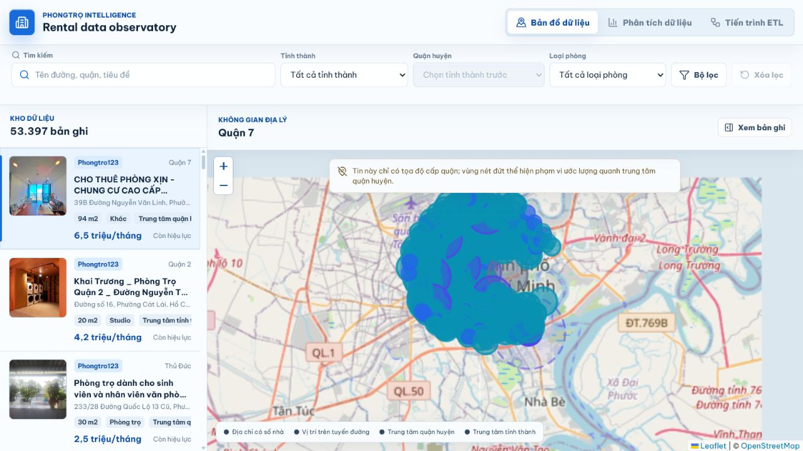
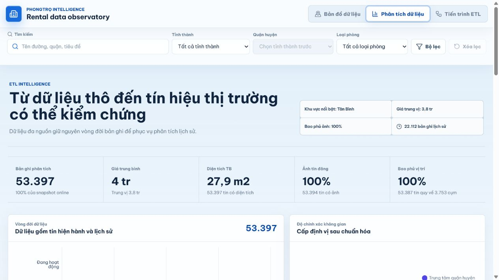
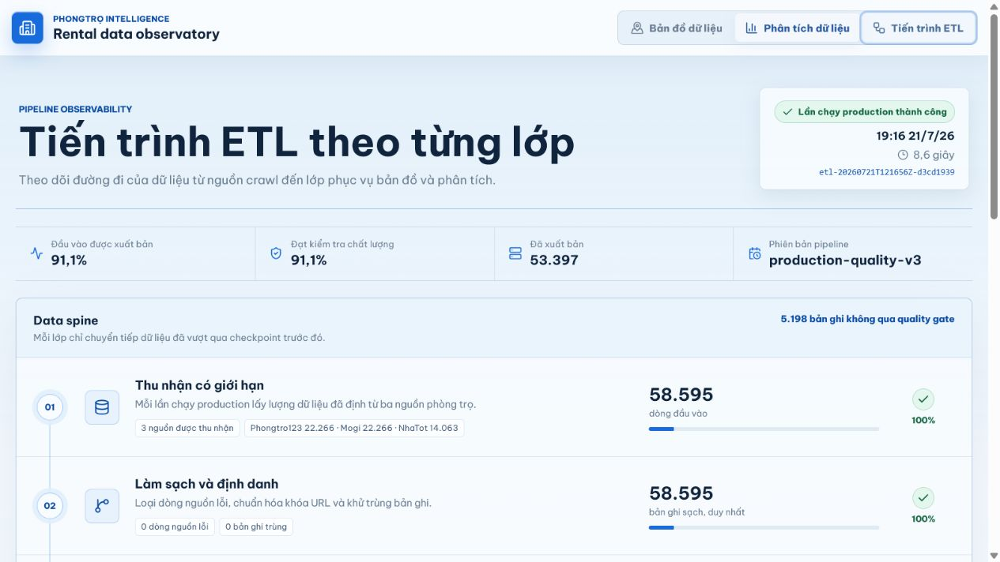
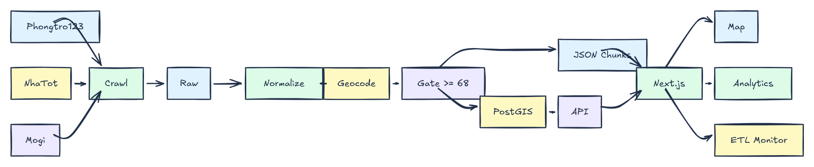
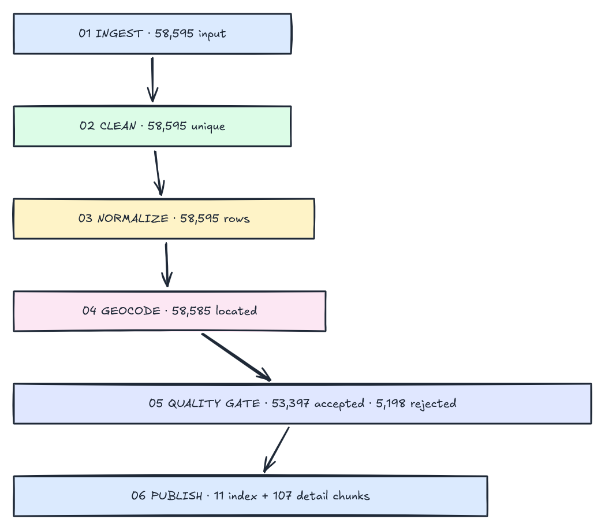

<div align="center">

# PhongTro Intelligence

### Nền tảng dữ liệu phòng trọ đa nguồn tại Việt Nam

Từ crawl dữ liệu công khai đến bản đồ, dashboard phân tích và giám sát ETL có thể kiểm chứng.

[](https://phongtro-intelligence.onrender.com)


[Xem web trực tiếp](https://phongtro-intelligence.onrender.com) · [English](README.md) · [Kiến trúc](docs/architecture.md) · [Vận hành](docs/local-operations.md)

</div>

---

## Dự án giải quyết bài toán gì?

PhongTro Intelligence biến dữ liệu tin phòng trọ rời rạc thành một sản phẩm phân tích có thể truy vết:

1. thu thập dữ liệu từ ba nguồn công khai đã kiểm chứng;
2. lưu snapshot theo nguồn để có thể tái lập;
3. chuẩn hóa giá, diện tích, địa chỉ, liên hệ và tiện ích;
4. khử trùng và tạo định danh ổn định;
5. chuẩn hóa địa điểm và mức chính xác không gian;
6. áp dụng quality gate có điểm số;
7. xuất dữ liệu theo chunk cho bản đồ, dashboard và ETL observatory.

Web production chạy được mà không cần tài khoản cloud trả phí hoặc backend luôn bật. Snapshot đã qua quality gate được đóng gói cùng Next.js static site trên Render; PostgreSQL/PostGIS, FastAPI và Supabase là các đường serving tùy chọn.

## Giao diện đang chạy

### Bản đồ 53.397 tin phòng trọ



Người dùng có thể tìm kiếm, lọc theo tỉnh/quận, giá, diện tích, loại phòng, tiện ích và xem rõ mức chính xác của vị trí.

### Phân tích thị trường và theo dõi ETL

| Dashboard phân tích | Monitor ETL sáu giai đoạn |
|---|---|
| Giá trung vị, diện tích, nguồn cung, tiện ích, nguồn crawl và chất lượng vị trí | Đầu vào, chuẩn hóa, geocode, quality gate, tỷ lệ giữ lại và lịch sử run |
|  |  |

## Snapshot production đã kiểm chứng

| Chỉ số | Kết quả |
|---|---:|
| Dòng đầu vào | 58.595 |
| Tin được xuất bản | **53.397** |
| Tỷ lệ qua quality gate | **91,1%** |
| Dòng bị loại bởi quality rules | 5.198 |
| Tin có ảnh | 53.394 |
| Tin có thông tin liên hệ | 34.032 |
| Tin quy được vị trí | 53.387 |
| Tỉnh thành | 39 |
| Index chunk / detail chunk | 11 / 107 |
| Production run | `etl-20260721T121656Z-d3cd1939` |
| Phiên bản pipeline | `production-quality-v3` |

Đóng góp sau quality gate:

| Nguồn | Số tin |
|---|---:|
| Phongtro123 | 22.264 |
| Mogi | 18.040 |
| NhaTot | 13.093 |

## Kiến trúc hệ thống

Sơ đồ được tạo và xuất trực tiếp bằng **Excalidraw MCP**.



[Mở file Excalidraw có thể chỉnh sửa](docs/readme-assets/architecture-overview.excalidraw)

Hệ thống có hai đường serving:

- **Mặc định miễn phí:** JSON chunks → Next.js static export → Render.
- **Tùy chọn dữ liệu live:** PostgreSQL/PostGIS hoặc Supabase → FastAPI/REST → Next.js.

## Luồng ETL production



[Mở sơ đồ ETL dạng Excalidraw](docs/readme-assets/etl-production-flow.excalidraw)

Quality gate loại 971 dòng thiếu trường cốt lõi và 4.227 dòng có điểm chất lượng dưới 68. Có 10 dòng không quy được về vị trí tham chiếu phù hợp. Snapshot public không bị cắt theo quota tròn.

## Điểm kỹ thuật nổi bật

- Crawler riêng cho Phongtro123, NhaTot và Mogi.
- Canonical URL, source ID, content hash và fingerprint cho khả năng truy vết.
- Watermark/checkpoint theo nguồn để chạy backfill có thể tiếp tục.
- Quality score tái lập, quarantine rõ lý do.
- Phân biệt tọa độ số nhà, tuyến đường, trung tâm quận và trung tâm tỉnh.
- Index tải trước, 107 detail chunk được lazy-load khi người dùng mở tin.
- Có thể bật Supabase/FastAPI nhưng web public không phụ thuộc vào chúng.
- Monitor ETL hiển thị count, retention, rejection, nguồn và lịch sử run.

## Công nghệ

| Thành phần | Công nghệ |
|---|---|
| Crawl | Python, HTTPX, BeautifulSoup, lxml, Tenacity |
| Transform | Python, Pydantic, quality scoring |
| Storage | JSON snapshot, PostgreSQL 16, PostGIS |
| API | FastAPI, SQLAlchemy, psycopg |
| Frontend | Next.js 15, React 19, TypeScript |
| Trực quan | Leaflet, React Leaflet, Recharts |
| Điều phối | PowerShell runbook, GitHub Actions |
| Deployment | Render Static Site, Supabase tùy chọn |

## Cấu trúc repo

```text
backend/                 FastAPI và đường serving PostgreSQL
crawler/                 source adapters, ETL và publication jobs
docs/readme-assets/      ảnh live và sơ đồ Excalidraw chỉnh sửa được
infra/                   Docker Compose và cloud infrastructure tùy chọn
sql/                     PostGIS schema và Supabase views
web/                     bản đồ, analytics và ETL observatory
.github/workflows/       ETL thủ công/định kỳ
```

## Chạy trên máy

```powershell
docker compose -f infra/docker-compose.yml up -d

cd backend
python -m venv .venv
.\.venv\Scripts\Activate.ps1
pip install -e .
uvicorn app.main:app --reload --port 8000

cd ..\web
npm install
npm run dev
```

Mở <http://localhost:3000>.

Chạy crawler mẫu:

```powershell
cd crawler
python -m venv .venv
.\.venv\Scripts\Activate.ps1
pip install -e .
python -m app.main bootstrap --city "ho-chi-minh" --max-pages 3 --sources all
```

Backfill ba nguồn có checkpoint:

```powershell
.\crawler\scripts\balanced_backfill.ps1
```

## Kiểm thử

```bash
cd crawler
python -m pytest -q                 # 29 passed

cd ../web
npm run validate:data              # 53.397 index/detail rows
npm run lint                       # passed
npm run build                      # production build passed
```

## Sử dụng dữ liệu có trách nhiệm

Đây là dự án học thuật sử dụng các tin đăng công khai. Hệ thống giữ tên nguồn và canonical URL để truy vết. Khi vận hành cần giới hạn tốc độ crawl, tuân thủ điều khoản/robots policy của từng nguồn và không sử dụng thông tin liên hệ cho spam hoặc tái phân phối như một tập dữ liệu độc lập.

## Tài liệu

- [Trạng thái deployment hiện tại](docs/online-deploy-status.md)
- [Vận hành local](docs/local-operations.md)
- [Kiểm kê trường dữ liệu](docs/data-inventory.md)
- [Thiết kế ETL](docs/etl-pipeline.md)
- [Kiến trúc](docs/architecture.md)
- [Báo cáo hoàn thiện](docs/bao-cao-hoan-thien.md)

## Giấy phép

Mã nguồn phát hành theo [MIT License](LICENSE). Nội dung tin đăng thuộc quyền sở hữu của các nguồn tương ứng.
